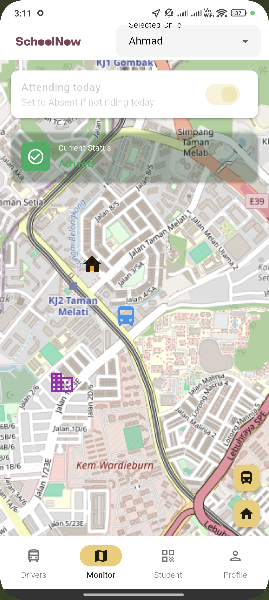
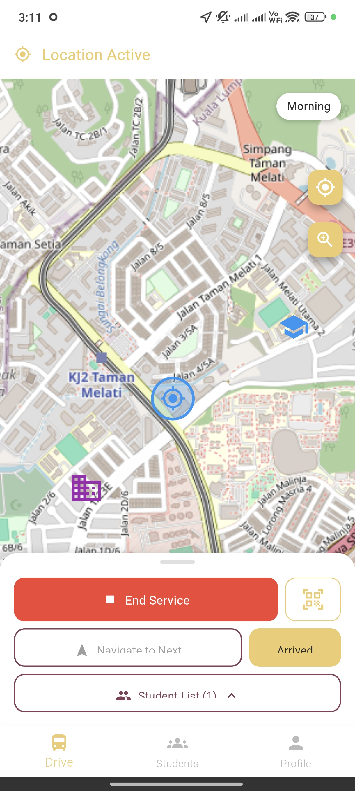
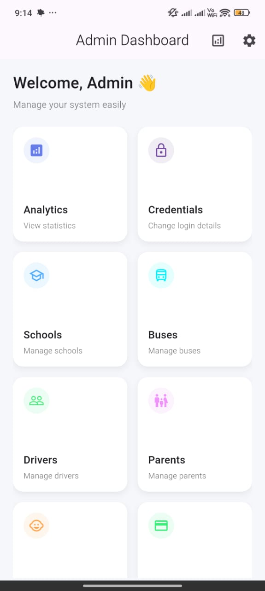

# SchoolNow - Smart School Transportation Management Platform

A comprehensive, real-time school transportation management system connecting parents, drivers, and administrators through intelligent mobile and desktop applications.

## Project Overview

SchoolNow is a complete end-to-end solution for managing school bus transportation services with modern mobile technology and cloud infrastructure.

The platform connects three key stakeholders:

- **Parents/Guardians**: Monitor children's trips in real-time
- **Drivers**: Manage routes and student pickups efficiently
- **Administrators**: Oversee operations, manage fleet, optimize routes

## Screenshots

  

_Parent App - Real-time Monitoring | Driver App - Trip Management | Admin Dashboard - Fleet Control_

## Applications

### [SchoolNow Parent App](./school_now/)

**Mobile Application for Parents and Guardians**

Real-time GPS tracking, trip history, payment processing, emergency notifications.

**Platforms**: iOS, Android, Web | **Tech**: Flutter, Firebase, Google Maps

[Read Full Documentation](./school_now/README.md)

---

### [SchoolNow Driver App](./school_now_driver/)

**Mobile Application for Transportation Drivers**

Trip assignments, student management, navigation, automatic app updates.

**Platforms**: iOS, Android | **Tech**: Flutter, Firebase, OpenStreetMap

[Read Full Documentation](./school_now_driver/README.md)

---

### [SchoolNow Admin Panel](./school_now_admin/)

**Desktop & Mobile Dashboard for Administrators**

Driver management, fleet operations, service areas, real-time monitoring, analytics.

**Platforms**: Windows, macOS, Linux, iOS, Android, Web | **Tech**: Flutter, Firebase

[Read Full Documentation](./school_now_admin/README.md)

---

## Key Features

### Real-Time Tracking

Live GPS tracking of vehicles and students
Interactive maps with polyline routes
ETA calculations and delay notifications

### Smart Management

Automated trip assignments
Route optimization
Service area-based student assignment

### Secure Communication

Real-time parent notifications
Driver-to-admin messaging
Emergency alert system

### Financial Integration

Secure payment processing
Invoice and receipt management
Transaction reporting

## Technology Stack

**Frontend**: Flutter 3.x, Dart, Material Design 3
**Backend**: Firebase (Auth, Firestore, Realtime DB, Cloud Functions)
**Maps**: OpenStreetMap, Google Maps
**Location**: Geolocator Plugin, Background Services
**Infrastructure**: Google Cloud, Firebase Hosting

## Project Structure

`SchoolNow/
 school_now/              # Parent/Guardian App
 school_now_driver/       # Driver App
 school_now_admin/        # Admin Dashboard
 packages/                # Shared packages
 functions/               # Cloud Functions
 hosting/                 # Static assets
 firebase.json`

## Quick Start

`ash

# Clone repository

git clone https://github.com/yourusername/SchoolNow.git
cd SchoolNow

# Run Parent App

cd school_now && flutter pub get && flutter run
`

## Data Flow

Driver GPS Firebase Realtime DB Parent's Live Map

Trip Lifecycle: Assign Accept Navigate Location Updates Check-in/out Complete Analytics

## Security & Privacy

- End-to-End Encryption (HTTPS)
- Firebase Security Rules (role-based access)
- Secure Authentication
- GDPR Compliant
- Audit Logging

## Features by Role

**Parents**: Real-time tracking, payments, history, notifications
**Drivers**: Trip assignments, navigation, check-in/out, auto-updates
**Admins**: Driver management, fleet control, monitoring, analytics

## Performance

- Location updates: 30-second intervals
- Map load time: < 2 seconds
- Offline support with automatic sync
- Supports thousands of concurrent users

## Project Highlights

Real-time tracking with battery optimization
Single codebase for iOS, Android, Web, Desktop
Cloud-based scalable infrastructure
Offline-first design with automatic sync
Professional UI/UX design
Enterprise-grade security

## Future Enhancements

- ML-based route optimization
- Predictive analytics
- Voice-guided navigation
- Incident reporting
- Driver performance analytics
- Multi-language support
- Public transit integration

## Deployment

**Android**: lutter build apk --release
**iOS**: lutter build ios --release
**Web**: lutter build web --release

Auto-updates available via Firebase Hosting.

---

**Built with using Flutter and Firebase**
